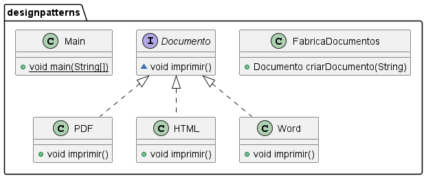

# Singleton

Esse padrão de projeto é utilizado quando se deseja criar um apenas uma instância da classe. Ele pode ser utilizado,
por exemplo, em sistemas de login ou sistemas de segurança, onde se torna interessante existir apenas uma instância de uma classe. Para isso, como por exemplo, ela terá um método para realizar o *login*.
Neste caso, como ela estará disponível para toda aplicação, não faz sentido que hajam várias instâncias desta classe.

A classe ficará da seguinte forma inicialmente:

```java
package designpatterns;

public class SecurityManager {
    public void login() {
        // Realiza login de alguma forma.
    }
}
```

Porém desta forma, ainda é possível instanciar mais de um objeto deste ``SecurityManager``. O código abaixo compila
normalmente.

```java
package designpatterns;

public class App {
    public static void main(String[] args) {
        SecurityManager manager = new SecurityManager();
        SecurityManager manager2 = new SecurityManager();
    }
}
```

Então, se não houver esse cuidado, o código permitirá várias instâncias desta classe. O *Singleton* atende justamente a esta demanda. Então a primeira coisa a ser feita é deixar o construtor como privado:

```java
private SecurityManager() {
}
```

Neste momento, apenas a classe consegue maninpular o construtor, uma vez que ele é privado. Então, não é possível que
elementos externos possam criar instâncias. Porém vem um questionamento, se elementos externos não podem instanciar
objetos, quem pode ? *A própria classe*. Já como será a própria classe (e não ao objeto) que irá realizar essa
manipulação, precisaremos de um atributo estático.

```java
private static SecurityManager instance;

private SecurityManager() {
}
```

Por convenção, o nome deste atributo se chama *instance*. Já para retornar esta instância única. Para isso, é necessário
testar se já existe alguma instância da classe *SecurityManager*. Caso não exista, cria uma nova; caso contrário não
faça nada.

```java
private static SecurityManager instance;

private SecurityManager() {
}

public static SecurityManager getInstance() {
    if (instance == null) {
        instance = new SecurityManager();
        System.out.println("Login realizado com sucesso");
    }
    return instance;

}
```

Uma forma de representar essa implementação é através de diagrama de classes. Que pode ser representada na forma abaixo:

<center>)</center>

Com essa implementação, para ser possível utilizar a classe SecurityManager é da seguinte forma:

```java
package designpatterns;

public class App {
    public static void main(String[] args) {
        SecurityManager manager = SecurityManager.getInstance();
        SecurityManager manager2 = SecurityManager.getInstance();
    }
}
```

Olhando o método *getInstance()* quando é chamado a primeira vez ele cria o objeto (já que ainda não objeto criado, ou
seja, o valor do objeto é null). Já na segunda instância como o valor não é *null* não criação do objeto, ou pode ser
considerado que está sendo retornado sempre o mesmo valor de instância. Assim,
referência apontada para ambos objetos é a mesma. Isso pode ser provado se imprimirmos ambos objetos.

```java
public class App {
    public static void main(String[] args) {
        SecurityManager manager = SecurityManager.getInstance();
        SecurityManager manager2 = SecurityManager.getInstance();

        System.out.println(manager);
        System.out.println(manager2);
    }
}
```

Teremos a seguinte saída:

```
Login realizado com sucesso
designpatterns.SecurityManager@3ac3fd8b
designpatterns.SecurityManager@3ac3fd8b
```

E sempre será usada essa instância única para qualquer parte do código seja alguma classe, pacote ou interface.

Uma das vantagens dessa abordagem é a rápida implementação.
